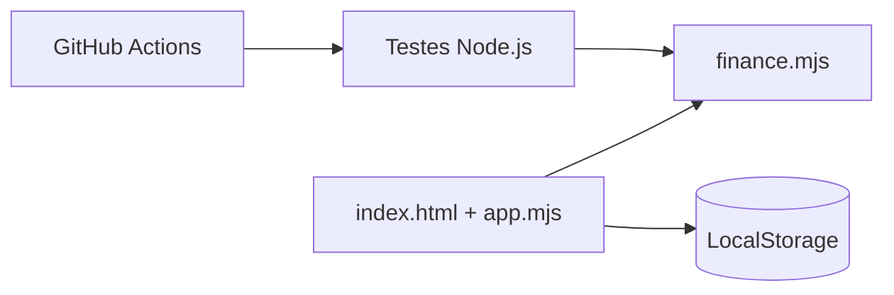

# DividimOS Lite - Bootcamp III

Aplicação web simples para registrar despesas compartilhadas entre duas pessoas e calcular automaticamente o saldo de cada participante.

## Problema

Em despesas compartilhadas, é comum perder o controle de quem pagou cada conta e quanto cada pessoa deve ao final. O projeto registra despesas e calcula o acerto automaticamente.

## Funcionalidades

- Cadastro de dois participantes.
- Registro de descrição, valor e pagador.
- Rateio automático.
- Saldo individual.
- Persistência no navegador.
- Testes automatizados.
- CI com GitHub Actions.
- ADRs e fluxo de governança.

## Arquitetura



## Executar localmente

Se houver Python disponível:

```bash
python -m http.server 8000 -d web
```

Depois abra:

`http://localhost:8000`

Também é possível abrir os arquivos com uma extensão/servidor local de sua preferência.

## Testes

O CI usa Node.js 22 e executa:

```bash
cd entrega-2-intermediaria

npm test
```

Não é necessário instalar Node.js no computador da sala para que o GitHub Actions execute os testes.

## Governança

Veja:

- `CONTRIBUTING.md`
- `.github/PULL_REQUEST_TEMPLATE.md`
- `.github/ISSUE_TEMPLATE/tarefa.md`

## Decisões arquiteturais

- `docs/adr/0001-frontend-estatico.md`
- `docs/adr/0002-persistencia-local.md`
- `docs/adr/0003-ci.md`

## Documentos da entrega

- `docs/ERROS-E-REESPECIFICACAO.md`
- `docs/ANALISE-IA.md`
- `docs/PROMPT-PADRAO-AGENTES.md`
- `docs/CHECKLIST-ENTREGA.md`
- `docs/RELATORIO-FINAL.md`

## Segurança

Não inserir segredos, tokens, senhas ou dados pessoais reais neste repositório.